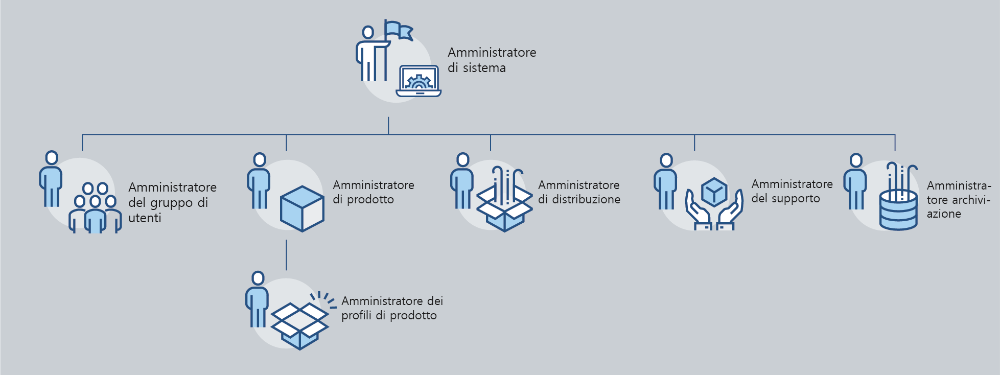
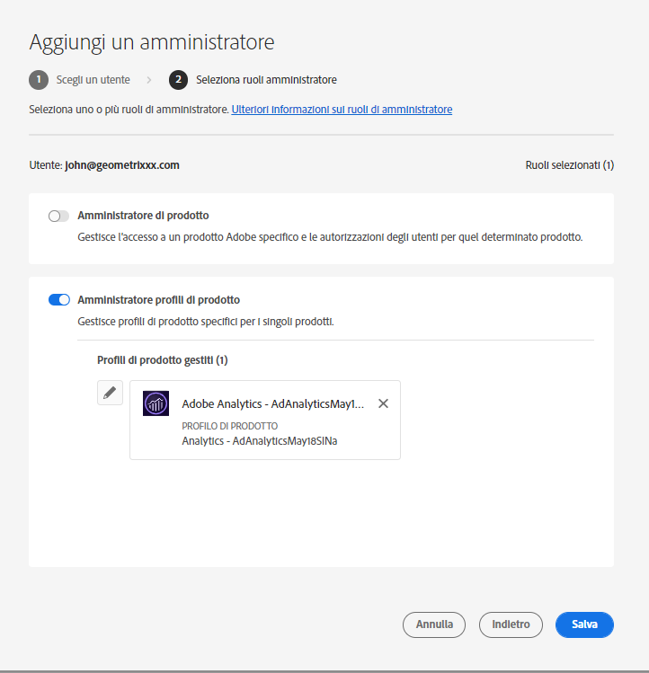
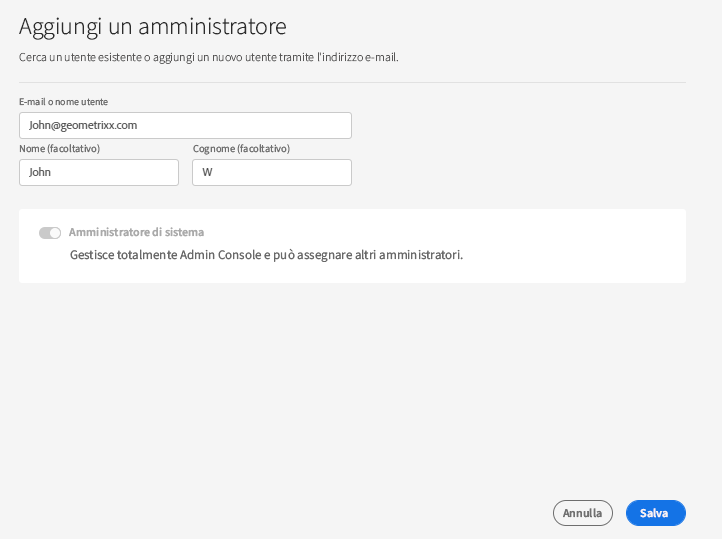
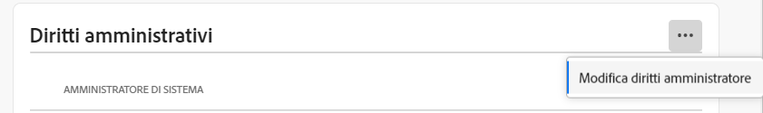
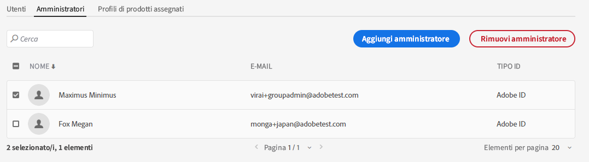

# Ruoli amministrativi

Utilizzando Adobe Admin Console, le organizzazioni possono definire una gerarchia amministrativa flessibile che consenta una gestione dettagliata dell’accesso e dell’utilizzo dei prodotti Adobe. Uno o più amministratori di sistema, abilitati durante il processo di onboarding aziendale, si trovano nella parte superiore della gerarchia. Questi amministratori di sistema possono delegare le responsabilità ad altri amministratori, pur mantenendo il controllo complessivo.

I ruoli amministrativi offrono alle aziende i seguenti vantaggi principali:

* decentramento controllato delle responsabilità amministrative
* Visualizzazione rapida delle assegnazioni dei prodotti, per utente e per prodotto
* Funzionalità per assegnare quote agli amministratori di prodotto

## Gerarchia amministrativa

Si applica a: Clienti aziendali di Adobe.

La gerarchia amministrativa può essere utilizzata per soddisfare i requisiti unici dell&#39;azienda. Ad esempio, un’azienda può nominare diversi amministratori per gestire le adesioni alle offerte Adobe Creative Cloud e Adobe Marketing Cloud. In alternativa, un&#39;azienda può avere amministratori diversi per gestire le adesioni degli utenti appartenenti a business unit diverse.

>[!NOTE]
>
>La gerarchia amministrativa non si applica ai clienti dei team. I clienti del team hanno un solo **Amministratore di sistema** ruolo. Titolare del contratto (_precedentemente indicato come **Amministratore principale**_) è l’amministratore di sistema con accesso ai dettagli del contratto e alla cronologia di fatturazione. Se sei il proprietario del contratto corrente, puoi nominare un amministratore di sistema esistente (_ precedentemente indicato come **amministratore secondario**_) come proprietario del contratto.

_Gerarchia dei ruoli amministratore_

| Ruolo | Descrizione |
|--- |--- |
| **Amministratore di sistema** | Super utente per l&#39;organizzazione; consentito eseguire tutte le attività amministrative nell&#39;Admin Console. Inoltre, dispone delle autorizzazioni per delegare le seguenti funzionalità amministrative ad altri utenti: Amministratore del prodotto, amministratore del profilo di prodotto, amministratore del gruppo di utenti, amministratore della distribuzione e amministratore del supporto. |
| **Amministratore del prodotto** | Amministra i prodotti assegnati a tale amministratore e tutte le funzioni amministrative associate, che includono:<ul><li>Creare profili di prodotto</li><li>Aggiungi utenti e gruppi di utenti all&#39;organizzazione ma non rimuovili</li><li>Aggiungere o rimuovere utenti e gruppi di utenti dai profili di prodotto</li><li>Aggiungere o rimuovere amministratori del profilo di prodotto dai profili di prodotto</li><li>Aggiungi o rimuovi altri amministratori di prodotto dal prodotto</li><li>Aggiungi o rimuovi amministratori di gruppo dai gruppi</li></ul> |
| **Amministratore del profilo di prodotto** | Amministra le descrizioni del profilo di prodotto assegnate a tale amministratore e a tutte le funzioni amministrative associate, che includono:<ul><li>Aggiungi utenti e gruppi di utenti all&#39;organizzazione ma non rimuovili</li><li>Aggiungere o rimuovere utenti e gruppi di utenti dai profili di prodotto</li><li>Assegnare o revocare le autorizzazioni di prodotto a utenti e gruppi di utenti dai profili di prodotto</li><li>Gestione dei ruoli di prodotto di utenti e gruppi di utenti per i profili di prodotto |
| **Amministratore di un gruppo di utenti** | Amministra le descrizioni del gruppo di utenti assegnate a tale amministratore e a tutte le funzioni amministrative associate, che includono:<ul><li>Aggiungi o rimuovi utenti dai gruppi</li><li>Aggiungi o rimuovi gli amministratori dei gruppi di utenti dai gruppi |
| **Amministrazione distribuzione** | Crea, gestisce e distribuisce pacchetti software e aggiornamenti agli utenti finali. |
| **Amministratore del supporto** | Ruolo non amministrativo con accesso alle informazioni relative al supporto, ad esempio i report dei problemi segnalati dai clienti. |
| **Amministratore dello storage** | Gestisce l&#39;amministrazione dello storage dell&#39;organizzazione. L’amministratore può visualizzare il consumo di archiviazione sia degli utenti attivi che inattivi e trasferire il contenuto ad altri destinatari. |

Per un elenco dettagliato delle autorizzazioni e dei privilegi per ogni ruolo di amministratore, vedi [Autorizzazioni](#enterprise-admins-permissions-matrix).

## Aggiungi un amministratore aziendale

Si applica a: Clienti aziendali di Adobe.

In qualità di amministratore, puoi assegnare un ruolo di amministratore ad altri utenti, assegnando loro gli stessi privilegi di cui disponi, o privilegi per un ruolo sotto il tuo ruolo di amministratore nella gerarchia come descritto [sopra](#administrative-hierarchy). Ad esempio, in qualità di amministratore di prodotto puoi assegnare privilegi di amministratore di prodotto o privilegi di amministratore del profilo di prodotto a un utente, ma non i privilegi di amministratore della distribuzione. Per le autorizzazioni sull&#39;Admin Console, consulta la sezione [Matrice di autorizzazioni](#enterprise-admins-permissions-matrix).

Per aggiungere o invitare un amministratore:

1. In [Admin Console](https://adminconsole.adobe.com/), scegli **Utenti** > **Amministratori**.

   In alternativa, accedi al prodotto, al profilo di prodotto o al gruppo di utenti interessato e passa al **Amministratori** scheda .

1. Fai clic su **Aggiungi amministratore**.
1. Immetti un nome o un indirizzo e-mail. È possibile cercare gli utenti esistenti o aggiungere un nuovo utente specificando un indirizzo e-mail valido e compilando le informazioni sullo schermo.
1. Fai clic su **Successivo**. Viene visualizzato un elenco di ruoli di amministratore.

>[!NOTE]
>
>* Le opzioni di questa schermata dipendono dal tuo account e dal tuo ruolo di amministratore. Puoi assegnare gli stessi privilegi che hai oppure i privilegi per un ruolo sotto il tuo nella gerarchia.
>* In qualità di amministratore di sistema di un team, puoi assegnare un solo ruolo di amministratore: Amministratore di sistema.

1. Seleziona uno o più ruoli di amministratore.
1. Per i tipi amministratore come Amministratore prodotto, Amministratore profilo prodotto e Amministratore gruppo utenti, seleziona rispettivamente i prodotti, i profili e i gruppi specifici.

>[!NOTE]
>
>Per un amministratore del profilo di prodotto, puoi includere profili per più di un prodotto.

1. Esamina i ruoli amministratore assegnati all’utente e fai clic su **Salva**.

L’utente riceve un invito e-mail relativo ai nuovi privilegi amministrativi da `message@adobe.com`.

Gli utenti devono fare clic su **Introduzione** nell’e-mail per partecipare all’organizzazione. Se i nuovi amministratori non utilizzano il **Introduzione** nell’invito e-mail, non saranno in grado di accedere all’Admin Console.

Come parte del processo di accesso, gli utenti possono essere invitati a impostare un profilo di Adobe se non ne hanno già uno. Se gli utenti dispongono di più profili associati al proprio indirizzo e-mail, devono scegliere &quot;Join Team&quot; (se richiesto) e quindi selezionare il profilo associato alla nuova organizzazione.

## Aggiungi un amministratore del team {#add-admin-teams}

Si applica a: Adobe team i clienti.

In qualità di amministratore, puoi assegnare il ruolo di amministratore di sistema ad altri utenti, concedendo loro gli stessi privilegi che hai.

Per aggiungere o invitare un amministratore di sistema:

1. Nell’Admin Console, scegli **Utenti** > **Amministratori**.

   Viene visualizzato un elenco di amministratori esistenti.

1. Fai clic su **Aggiungi amministratore**.

   La **Aggiungi un amministratore** viene visualizzato lo schermo.

1. Immetti un nome o un indirizzo e-mail. È possibile cercare gli utenti esistenti o aggiungere un nuovo utente specificando un indirizzo e-mail valido e compilando le informazioni sullo schermo.

   Per impostazione predefinita, l&#39;opzione Amministratore di sistema è selezionata.

1. Fai clic su **Salva**.

Poiché tutti gli utenti di un&#39;organizzazione del team sono utenti di Business ID, ricevono un invito e-mail relativo ai nuovi privilegi amministrativi da `message@adobe.com`.
Per partecipare all’organizzazione, gli utenti devono fare clic su Introduzione nell’e-mail .

Come parte del processo di accesso, gli utenti possono essere invitati a impostare un profilo di Adobe se non ne hanno già uno. Se gli utenti dispongono di più profili associati al proprio indirizzo e-mail, devono scegliere &quot;Join Team&quot; (se richiesto) e quindi selezionare il profilo associato alla nuova organizzazione.

## Modificare il ruolo di amministratore enterprise

Si applica a: Clienti aziendali di Adobe.

In qualità di amministratore, puoi modificare il ruolo di amministratore in un altro amministratore che si trova sotto di te nella gerarchia amministrativa. Ad esempio, puoi rimuovere i privilegi di amministratore di altri amministratori.

Per modificare i ruoli di amministratore:

1. Nell’Admin Console, scegli **Utenti** > **Amministratori**. Viene visualizzato l’elenco degli amministratori esistenti.

   In alternativa, accedi al prodotto, al profilo di prodotto o al gruppo di utenti interessato e passa al **Amministratori** scheda .

1. Fai clic sul nome dell’amministratore da modificare.
1. In **Dettagli utente**, fai clic su  per **Diritti amministrativi** sezione e scegli **Modifica diritti di amministratore**.

   

1. Modifica i diritti amministrativi e salva le modifiche.

## Modifica il ruolo di amministratore del team

Si applica a: Adobe team i clienti.

In qualità di amministratore di sistema del team, puoi rimuovere i privilegi di amministratore di sistema di altri amministratori.

Per revocare i privilegi di amministratore di sistema:

1. Nell’Admin Console, scegli **Utenti** > **Amministratori**.

   Viene visualizzato l’elenco degli amministratori esistenti.

1. In Dettagli utente, fai clic su  a destra del **Diritti amministrativi** sezione e scegli **Modifica diritti di amministratore**.

   

1. Modifica i diritti amministrativi e salva le modifiche.

## Rimuovere un amministratore

Si applica a: Adobe Team per clienti aziendali.

1. Per revocare le autorizzazioni di amministratore, seleziona un utente e fai clic su **Rimuovi amministratore**.

>[!NOTE]
>
>La rimozione di un amministratore non comporta l’eliminazione dell’utente dall’Admin Console, ma rimuove solo i privilegi associati al ruolo di amministratore.

## Matrice di autorizzazioni per gli amministratori Enterprise

Si applica a: Clienti aziendali di Adobe.

Nella tabella seguente sono elencate tutte le autorizzazioni per i diversi tipi di amministratori, suddivisi per le seguenti aree di funzionalità:

### Gestione identità

| Autorizzazione | Amministratore di sistema | Amministratore del supporto |
|--- |--- |--- |
| Aggiungi dominio (richiede/registra un dominio) | ↓ |  |
| Visualizza elenco di domini e domini | ↓ |  |
| Gestire le chiavi di crittografia del dominio | ↓ |  |
| Gestisci criteri password organizzazione predefiniti | ↓ |  |
| Visualizza criteri password organizzazione predefiniti | ↓ |  |

### Gestione utente

| Autorizzazione | Amministratore di sistema | Amministratore del supporto |
|--- |--- |--- |
| Aggiungi utente all’organizzazione | ↓ |  |
| Rimuovi utente dall&#39;organizzazione | ↓ |  |
| Visualizza dettagli utente ed elenco | ↓ |  |
| Modificare il profilo utente | ↓ |  |
| Aggiungi profilo di prodotto a un utente o a un gruppo | ↓ |  |
| Rimuovi profilo prodotto a un utente o a un gruppo | ↓ |  |
| Aggiungi profilo di prodotto a più utenti | ↓ |  |
| Visualizzare i profili di prodotto per un utente | ↓ |  |
| Visualizza elenco utenti prodotto | ↓ |  |
| Aggiungere in blocco utenti all’organizzazione | ↓ |  |

### Gestione amministratori

| Autorizzazione | Amministratore di sistema | Amministratore del supporto |
|--- |--- |--- |
| Concedere l’amministratore dell’organizzazione a un utente | ↓ |  |
| Revoca dell’amministratore organizzazione da un utente | ↓ |  |
| Concedere l’amministratore della licenza del prodotto a un utente | ↓ |  |
| Revocare l’amministratore della licenza del prodotto da un utente | ↓ |  |
| Concedere l’amministratore della distribuzione a un utente | ↓ |  |
| Revocare l’amministrazione della distribuzione da un utente | ↓ |  |
| Concedere l’amministratore di un gruppo di utenti a un utente | ↓ |  |
| Revocare l’amministratore di un gruppo di utenti da un utente | ↓ |  |
| Concedere l’amministratore del proprietario del prodotto a un utente | ↓ |  |
| Revocare l’amministratore del proprietario del prodotto da un utente | ↓ |  |

### Gestione della configurazione delle licenze di prodotto

| Autorizzazione | Amministratore di sistema | Amministratore del supporto |
|--- |--- |--- |
| Concedere il diritto di prodotto all’organizzazione |  |  |
| Rimuovere l&#39;adesione al prodotto dall&#39;organizzazione |  |  |
| Visualizza il numero totale di licenze di proprietà dell&#39;organizzazione | ↓ |  |
| Visualizza i prodotti disponibili e le famiglie di prodotti | ↓ |  |
| Modifica descrizioni/dati della licenza del prodotto | ↓ |  |
| Provisioning della licenza di prodotto a un utente | ↓ |  |
| Disattivazione della licenza del prodotto da un utente | ↓ |  |
| Aggiungi nuova configurazione della licenza del prodotto | ↓ |  |
| Modifica della configurazione del servizio di licenza del prodotto | ↓ |  |
| Elimina la configurazione del servizio di licenza del prodotto | ↓ |  |
| Rimuovere l&#39;accesso al prodotto da un utente (eliminare tutte le configurazioni) | ↓ |  |

### Gestione dello storage

| Autorizzazione | Amministratore di sistema | Amministratore del supporto |
|--- |--- |--- |
| Visualizza cartelle utente attive e inattive | ↓ |  |
| Elimina cartelle utente inattive e trasferisci contenuto | ↓ |  |

### Distribuzione

| Autorizzazione | Amministratore di sistema | Amministratore del supporto |
|--- |--- |--- |
| Visualizza/utilizza la scheda Pacchetti | ↓ |  |

### Supporto

| Autorizzazione | Amministratore di sistema | Amministratore del supporto |
|--- |--- |--- |
| Visualizza scheda di supporto | ↓ |  |
| Gestire i casi di assistenza | ↓ | ↓ |

### Gestione dei gruppi di utenti

| Autorizzazione | Amministratore di sistema | Amministratore del supporto |
|--- |--- |--- |
| Crea gruppo di utenti | ↓ |  |
| Rimuovi gruppo utenti | ↓ |  |
| Aggiungi utente a gruppo di utenti | ↓ |  |
| Rimuovi utente da gruppo di utenti | ↓ |  |
| Assegnare un gruppo di utenti alla licenza del prodotto | ↓ |  |
| Rimuovere il gruppo utenti dalla licenza del prodotto | ↓ |  |
| Visualizza membro del gruppo di utenti | ↓ | ↓ |
| Visualizza elenco di gruppi di utenti | ↓ | ↓ |
