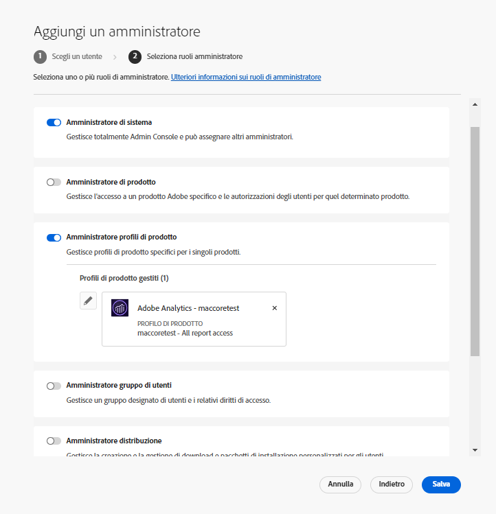

# Ruoli di amministrazione

Utilizzando Adobe Admin Console, le organizzazioni possono definire una gerarchia di amministrazione flessibile che consenta di gestire in modo articolato l’accesso e l’utilizzo dei prodotti Adobe. Uno o più amministratori di sistema, abilitati durante il processo di onboarding dell’azienda, occupano il livello di gerarchia più elevato. Gli amministratori di sistema possono delegare alcune responsabilità ad altri amministratori, pur mantenendo il controllo complessivo.

I ruoli di amministrazione offrono alle aziende i seguenti vantaggi principali:

* Decentramento controllato delle responsabilità amministrative
* Visualizzazione rapida delle assegnazioni dei prodotti, per utente e per prodotto
* Possibilità di assegnare quote agli amministratori di prodotto

## Gerarchia di amministrazione

Applicabile a: clienti Enterprise di Adobe.

La gerarchia di amministrazione può essere utilizzata per soddisfare specifici requisiti aziendali. Ad esempio, è possibile nominare amministratori diversi per gestire le adesioni alle offerte Adobe Creative Cloud e Adobe Marketing Cloud. Oppure, amministratori diversi possono gestire le adesioni degli utenti appartenenti a diverse business unit.

>[!NOTE]
>
>La gerarchia di amministrazione non è applicabili ai clienti Team. I clienti Team hanno un solo ruolo di **amministratore di sistema**. Il titolare del contratto (_precedentemente indicato come **amministratore principale**_) è l’amministratore di sistema che ha accesso ai dettagli del contratto e alla cronologia di fatturazione. Se sei il titolare del contratto corrente, puoi nominare un amministratore di sistema esistente (_ precedentemente indicato come **amministratore secondario**_) come titolare del contratto.

_Gerarchia dei ruoli di amministrazione_

| Ruolo | Descrizione |
|--- |--- |
| **Amministratore di sistema** | È l’utente dell’organizzazione in grado di eseguire tutte le attività di amministrazione in Admin Console. Inoltre, può delegare le seguenti funzionalità di amministrazione ad altri utenti: amministratore di prodotti, amministratore di profili di prodotto, amministratore di gruppi di utenti, amministratore di distribuzione e amministratore del supporto. |
| **Amministratore di prodotti** | Gestisce tutti i prodotti che gli sono stati assegnati in quanto amministratore e tutte le relative funzioni di amministrazione, che includono:<ul><li>Creare profili di prodotto</li><li>Aggiungere (ma non rimuovere) utenti e gruppi di utenti all’organizzazione</li><li>Aggiungere o rimuovere utenti e gruppi di utenti dai profili di prodotto</li><li>Aggiungere o rimuovere dai profili di prodotto gli amministratori di profili di prodotto</li><li>Aggiungere o rimuovere dal prodotto altri amministratori di prodotto</li><li>Aggiungere o rimuovere dai gruppi gli amministratori di gruppo</li></ul> |
| **Amministratore dei profili di prodotto** | Gestisce le descrizioni dei profili di prodotto che gli sono stati assegnati in quanto amministratore e tutte le relative funzioni di amministrazione, che includono:<ul><li>Aggiungere (ma non rimuovere) utenti e gruppi di utenti all’organizzazione</li><li>Aggiungere o rimuovere utenti e gruppi di utenti dai profili di prodotto</li><li>Assegnare o revocare dai profili di prodotto le autorizzazioni relative a un prodotto per utenti e gruppi di utenti</li><li>Gestire i ruoli di prodotto assegnati a utenti e gruppi di utenti per i profili di prodotto |
| **Amministratore di gruppi di utenti** | Gestisce le descrizioni dei gruppi di utenti che gli sono stati assegnati in quanto amministratore e tutte le relative funzioni di amministrazione, che includono:<ul><li>Aggiungere o rimuovere utenti dai gruppi</li><li>Aggiungere o rimuovere dai gruppi gli amministratori di gruppi di utenti |
| **Amministratore di distribuzione** | Crea, gestisce e distribuisce pacchetti software e aggiornamenti agli utenti finali. |
| **Amministratore del supporto** | Ruolo non amministrativo con accesso alle informazioni relative al supporto, ad esempio i rapporti sui problemi segnalati dai clienti. |
| **Amministratore archiviazione** | Gestisce l’archiviazione dell’organizzazione. Può visualizzare il consumo di spazio di archiviazione da parte di utenti sia attivi che inattivi, e può trasferire contenuti ad altri destinatari. |

Per un elenco dettagliato delle autorizzazioni e dei privilegi per ogni ruolo di amministratore, consulta la sezione [Autorizzazioni](#enterprise-admins-permissions-matrix).

## Aggiungere un ruolo di amministratore Enterprise {#add-enterprise-role}

Applicabile a: clienti Enterprise di Adobe.

In qualità di amministratore, puoi assegnare un ruolo di amministratore ad altri utenti, assegnando loro gli stessi privilegi di cui disponi, oppure privilegi per un ruolo di livello inferiore rispetto al tuo ruolo di amministratore, secondo la gerarchia descritta [qui sopra](#administrative-hierarchy). Ad esempio, se sei amministratore di prodotti, puoi assegnare a un utente il ruolo di amministratore di prodotti oppure di amministratore dei profili di prodotto, ma non quello di amministratore della distribuzione. Per informazioni sulle autorizzazioni in Admin Console, consulta la sezione [Matrice delle autorizzazioni](#enterprise-admins-permissions-matrix).

Per aggiungere o invitare un amministratore:

1. In [Admin Console](https://adminconsole.adobe.com/), scegli **Utenti** > **Amministratori**.

   In alternativa, accedi al prodotto, al profilo di prodotto o al gruppo di utenti che ti interessa e passa alla scheda **Amministratori**.

1. Fai clic su **Aggiungi amministratore**.
1. Immetti un nome o un indirizzo e-mail. È possibile cercare gli utenti esistenti o aggiungere un nuovo utente specificando un indirizzo e-mail valido e compilando le informazioni richieste nella schermata.
1. Fai clic su **Avanti**. Viene visualizzato un elenco di ruoli di amministratore.

>[!NOTE]
>
>* Le opzioni di questa schermata dipendono dal tuo account e dal tuo ruolo di amministratore. Puoi assegnare le tue stesse autorizzazioni oppure quelle per un ruolo di livello inferiore al tuo.
>* In qualità di amministratore di sistema di un team, puoi assegnare un solo ruolo di amministratore: Amministratore di sistema.

1. Seleziona uno o più ruoli di amministratore.
1. Per Amministratore di prodotto, Amministratore profili di prodotto e Amministratore gruppo utenti, seleziona rispettivamente i prodotti, i profili e i gruppi specifici.

>[!NOTE]
>
>Per un amministratore di profili di prodotto, puoi includere i profili di più prodotti.

1. Esamina i ruoli amministratore assegnati all’utente, quindi fai clic su **Salva**.

L’utente riceve un invito e-mail da `message@adobe.com` relativo alle sue nuove autorizzazioni di amministratore.

L’utente deve fare clic su **Inizia** nell’e-mail per partecipare all’organizzazione. Se non si utilizza il link **Inizia** presente nell’invito e-mail, non sarà possibile accedere ad Admin Console.

Durante il processo di accesso, potrebbe venire richiesto di impostare un profilo Adobe, se non se ne possiede già uno. Se l’utente dispone di più profili associati al proprio indirizzo e-mail, dovrà scegliere “Partecipa al team” (se richiesto) e quindi selezionare il profilo associato alla nuova organizzazione.

## Aggiungere un amministratore di team {#add-admin-teams}

Applicabile a: clienti Team di Adobe.

In qualità di amministratore, puoi assegnare il ruolo di amministratore di sistema ad altri utenti, concedendo loro le tue stesse autorizzazioni.

Per aggiungere o invitare un amministratore di sistema:

1. In Admin Console, scegli **Utenti** > **Amministratori**.

   Viene visualizzato un elenco di amministratori esistenti.

1. Fai clic su **Aggiungi amministratore**.

   Viene visualizzata la schermata **Aggiungi un amministratore**.

1. Immetti un nome o un indirizzo e-mail. È possibile cercare gli utenti esistenti o aggiungere un nuovo utente specificando un indirizzo e-mail valido e compilando le informazioni richieste nella schermata.

   Per impostazione predefinita, è selezionata l’opzione Amministratore di sistema.

1. Fai clic su **Salva**.

Poiché tutti gli utenti di un&#39;organizzazione del team sono utenti con Business ID, ricevono un invito e-mail relativo alle nuove autorizzazioni di amministrazione da `message@adobe.com`.
Per partecipare all’organizzazione, è necessario fare clic su “Inizia” nell’e-mail.

Durante il processo di accesso, potrebbe venire richiesto di impostare un profilo Adobe, se non se ne possiede già uno. Se l’utente dispone di più profili associati al proprio indirizzo e-mail, dovrà scegliere “Partecipa al team” (se richiesto) e quindi selezionare il profilo associato alla nuova organizzazione.

## Modificare il ruolo di amministratore Enterprise

Applicabile a: clienti Enterprise di Adobe.

In qualità di amministratore, puoi cambiare il ruolo di amministratore con un altro per gli amministratori di livello inferiore rispetto al tuo, nella gerarchia di amministratori. Ad esempio, puoi rimuovere i privilegi di amministrazione di altri amministratori.

Per modificare i ruoli di amministratore:

1. In Admin Console, scegli **Utenti** > **Amministratori**. Viene visualizzato l’elenco degli amministratori esistenti.

   In alternativa, accedi al prodotto, al profilo di prodotto o al gruppo di utenti che ti interessa e passa alla scheda **Amministratori**.

1. Fai clic sul nome dell’amministratore da modificare.
1. In **Dettagli utente**, fai clic su  per la sezione **Diritti amministrativi** e scegli **Modifica diritti amministrativi**.

   

1. Modifica i diritti amministrativi e salva le modifiche.

## Modificare il ruolo di amministratore del team

Applicabile a: clienti Team di Adobe.

In qualità di amministratore di sistema del team, puoi rimuovere i privilegi di amministratore di sistema di altri amministratori.

Per revocare i privilegi di amministratore di sistema:

1. In Admin Console, scegli **Utenti** > **Amministratori**.

   Viene visualizzato l’elenco degli amministratori esistenti.

1. In Dettagli utente, fai clic su  a destra della sezione **Diritti amministrativi** e scegli **Modifica diritti amministrativi**.

   

1. Modifica i diritti amministrativi e salva le modifiche.

## Rimuovere un amministratore

Applicabile a: clienti Team Enterprise di Adobe.

1. Per revocare le autorizzazioni di amministratore, seleziona un utente e fai clic su **Rimuovi amministratore**.

>[!NOTE]
>
>Quando si rimuove un amministratore, non si elimina l’utente stesso da Admin Console, ma si rimuovono i privilegi associati al ruolo di amministratore.

## Matrice delle autorizzazioni per gli amministratori Enterprise

Applicabile a: clienti Enterprise di Adobe.

Nella tabella seguente sono elencate tutte le autorizzazioni per i diversi tipi di amministratori, suddivisi per le seguenti aree di funzionalità:

### Gestione delle identità

| Autorizzazione | Amministratore di sistema | Amministratore del supporto |
|--- |--- |--- |
| Aggiungere un dominio (richiedere/registrare un dominio) | ✔ | |
| Visualizzare i domini e l’elenco di domini | ✔ | |
| Gestire le chiavi di crittografia del dominio | ✔ | |
| Gestire i criteri predefiniti per le password dell’organizzazione | ✔ | |
| Visualizzare i criteri predefiniti per le password dell’organizzazione | ✔ | |

### Gestione degli utenti

| Autorizzazione | Amministratore di sistema | Amministratore del supporto |
|--- |--- |--- |
| Aggiungere utenti all’organizzazione | ✔ | |
| Rimuovere utenti dall&#39;organizzazione | ✔ | |
| Visualizzare dettagli utente ed elenco degli utenti | ✔ | |
| Modificare il profilo utente | ✔ | |
| Aggiungere profili di prodotto a utenti o gruppi | ✔ | |
| Rimuovere profili di prodotto da utenti o gruppi | ✔ | |
| Aggiungere profili di prodotto a più utenti | ✔ | |
| Visualizzare i profili di prodotto di un utente | ✔ | |
| Visualizzare l’elenco degli utenti di un prodotto | ✔ | |
| Aggiungere in blocco più utenti all’organizzazione | ✔ | |

### Gestione degli amministratori

| Autorizzazione | Amministratore di sistema | Amministratore del supporto |
|--- |--- |--- |
| Assegnare il ruolo di amministratore dell’organizzazione a un utente | ✔ | |
| Revocare il ruolo di amministratore dell’organizzazione da un utente | ✔ | |
| Assegnare il ruolo di amministratore delle licenze prodotto a un utente | ✔ | |
| Revocare il ruolo di amministratore delle licenze prodotto a un utente | ✔ | |
| Assegnare il ruolo di amministratore dell’implementazione a un utente | ✔ | |
| Revocare il ruolo di amministratore dell’implementazione a un utente | ✔ | |
| Assegnate il ruolo di amministratore di un gruppo di utenti a un utente | ✔ | |
| Revocare il ruolo di amministratore di un gruppo di utenti da un utente | ✔ | |
| Assegnare il ruolo di amministratore dei proprietari di prodotto a un utente | ✔ | |
| Revocare il ruolo di amministratore dei proprietari di prodotto a un utente | ✔ | |

### Gestione della configurazione delle licenze di prodotto

| Autorizzazione | Amministratore di sistema | Amministratore del supporto |
|--- |--- |--- |
| Assegnare i diritti per un prodotto all’organizzazione | | |
| Rimuovere i diritti per un prodotto dall’organizzazione | | |
| Visualizzare il numero totale di licenze di proprietà dell&#39;organizzazione | ✔ | |
| Visualizzare i prodotti e le famiglie di prodotti disponibili | ✔ | |
| Modificare descrizioni/dati delle licenze di prodotti | ✔ | |
| Fornire la licenza di un prodotto a un utente | ✔ | |
| Disattivare la licenza di un prodotto per un utente | ✔ | |
| Aggiungere una nuova configurazione di licenza di prodotto | ✔ | |
| Modificare la configurazione del servizio di licenza di prodotto | ✔ | |
| Eliminare la configurazione del servizio di licenza di prodotto | ✔ | |
| Rimuovere l&#39;accesso a un prodotto per un utente (eliminare tutte le configurazioni) | ✔ | |

### Gestione dell’archiviazione

| Autorizzazione | Amministratore di sistema | Amministratore del supporto |
|--- |--- |--- |
| Visualizzare le cartelle di utenti attivi e inattivi | ✔ | |
| Eliminare le cartelle di utenti inattivi e trasferirne il contenuto | ✔ | |

### Distribuzione

| Autorizzazione | Amministratore di sistema | Amministratore del supporto |
|--- |--- |--- |
| Visualizzare/Utilizzare la scheda Pacchetti | ✔ | |

### Supporto

| Autorizzazione | Amministratore di sistema | Amministratore del supporto |
|--- |--- |--- |
| Visualizzare scheda Assistenza | ✔ | |
| Gestire i casi di supporto | ✔ | ✔ |

### Gestione dei gruppi di utenti

| Autorizzazione | Amministratore di sistema | Amministratore del supporto |
|--- |--- |--- |
| Creare un gruppo di utenti | ✔ | |
| Rimuovere un gruppo utenti | ✔ | |
| Aggiungere un utente a un gruppo di utenti | ✔ | |
| Rimuovere un utente da un gruppo di utenti | ✔ | |
| Assegnare un gruppo di utenti a una licenza di prodotto | ✔ | |
| Rimuovere un gruppo utenti da una licenza di prodotto | ✔ | |
| Visualizzare i membri di un gruppo di utenti | ✔ | ✔ |
| Visualizzare l’elenco dei gruppi di utenti | ✔ | ✔ |
