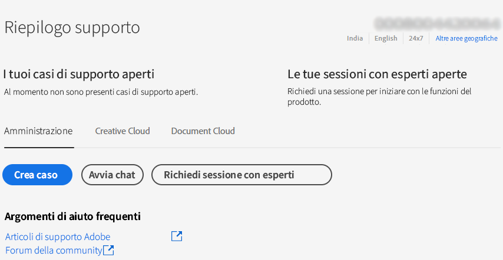

# Enterprise e team | Contattare l&#39;Assistenza clienti Adobe

Per contattare l’Assistenza clienti Adobe, passa alla pagina **Supporto** nella scheda [Admin Console](https://adminconsole.adobe.com/).

La **Scheda Supporto** in [Admin Console](https://adminconsole.adobe.com/) consente di accedere a varie opzioni di supporto tramite un’interfaccia semplice e intuitiva. Le opzioni disponibili nella scheda Supporto dipendono dal piano di abbonamento. Per ulteriori informazioni, fai clic su **Ulteriori informazioni** corrispondente al piano di abbonamento.

Se non sei sicuro del piano di abbonamento, passa alla **Scheda Supporto** sulla [Admin Console](https://adminconsole.adobe.com/)e confronta la visualizzazione con le immagini riportate di seguito. Quindi, fai clic sul corrispondente **Ulteriori informazioni** link.

## Account per team

<!--
[Learn more](https://helpx.adobe.com/enterprise/using/support-for-teams.html)
-->

## Per account enterprise

<!--
[Learn more](https://helpx.adobe.com/enterprise/using/support-for-enterprise.html)
-->

## Experience Cloud

<!--
[Learn more](https://www.adobe.com/go/ac_ec_not_supported_en)
-->
