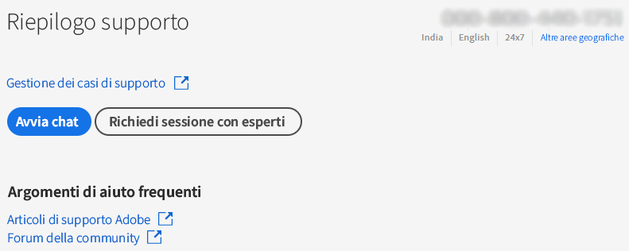
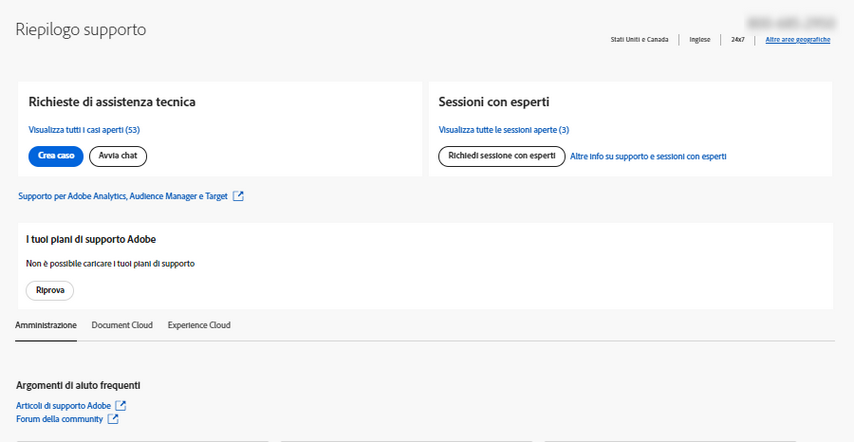

# Enterprise e Team | Contattare l’Assistenza clienti Adobe

Per contattare l’Assistenza clienti Adobe, passa alla scheda **Assistenza** in [Admin Console](https://adminconsole.adobe.com/).

La **scheda Assistenza** di [Admin Console](https://adminconsole.adobe.com/) consente di accedere a varie opzioni di supporto tramite un’interfaccia semplice e intuitiva. Le opzioni disponibili nella scheda Assistenza dipendono dal piano di abbonamento. Per ulteriori informazioni, fai clic su **Ulteriori informazioni** in corrispondenza del tuo piano di abbonamento.

Se non sei sicuro del piano di abbonamento applicabile, passa alla **scheda Assistenza** di [Admin Console](https://adminconsole.adobe.com/) e confronta la finestra visualizzata con le immagini riportate di seguito. Quindi, fai clic sul collegamento **Ulteriori informazioni** appropriato.

## Account Team

<!--
[Learn more](https://helpx.adobe.com/enterprise/using/support-for-teams.html)
-->

## Account Enterprise

<!--
[Learn more](https://helpx.adobe.com/enterprise/using/support-for-enterprise.html)
-->

## Experience Cloud

<!--
[Learn more](https://www.adobe.com/go/ac_ec_not_supported_en)
-->
