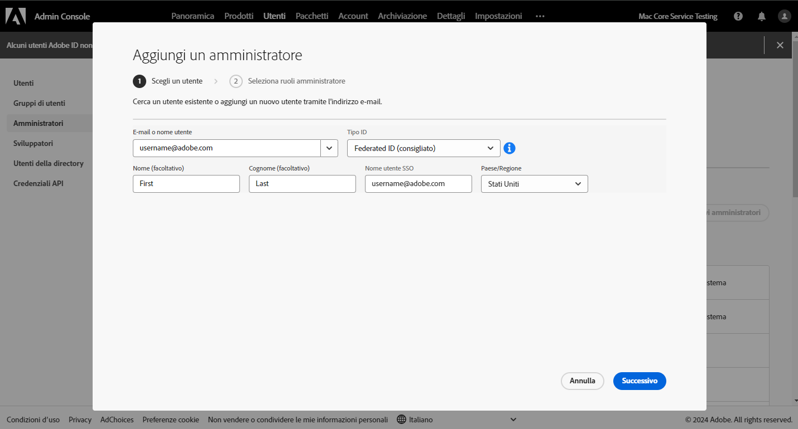
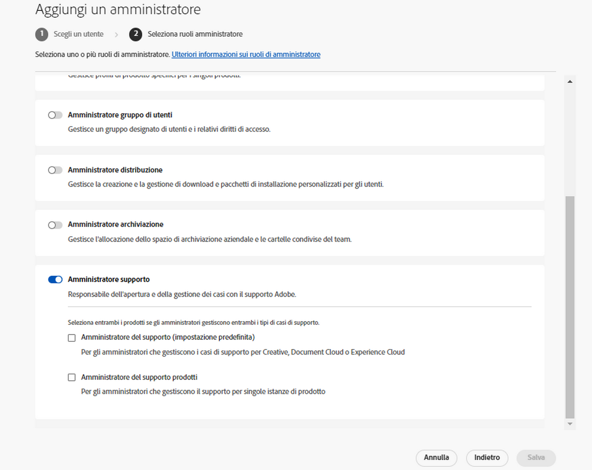
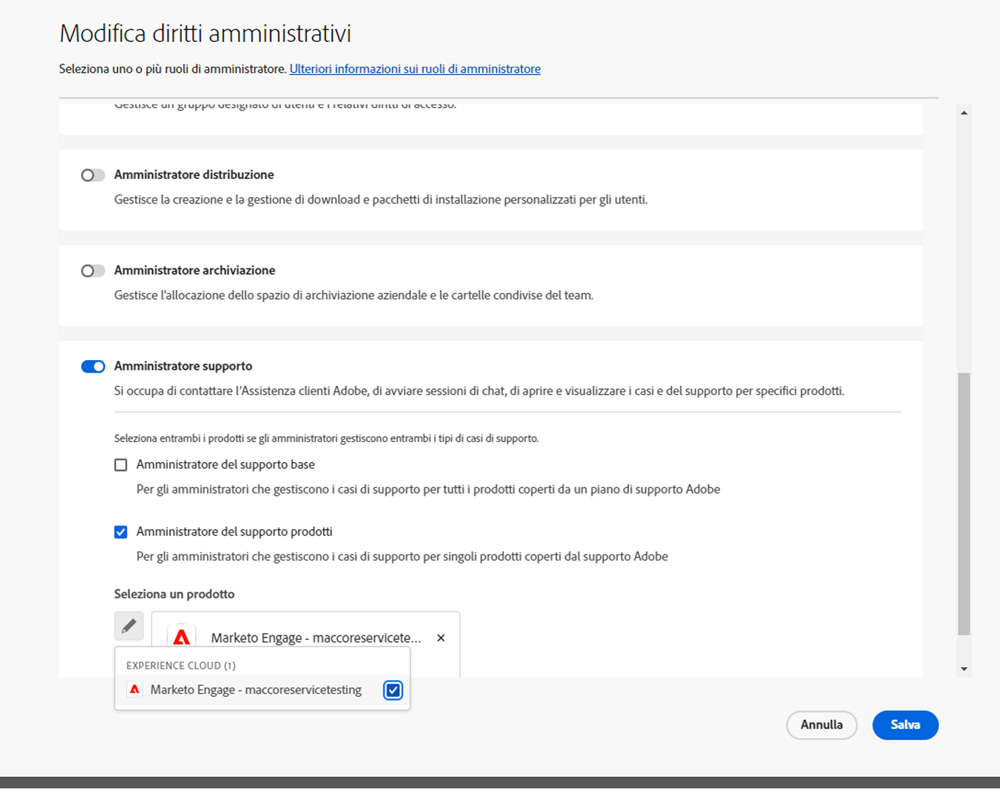
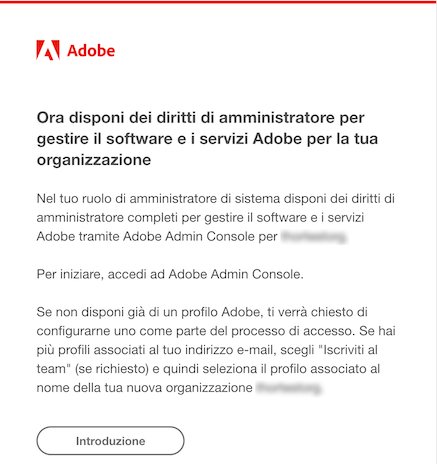
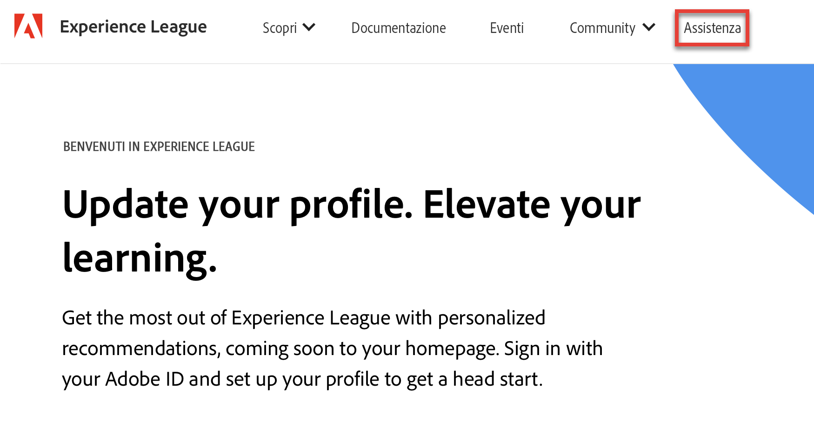
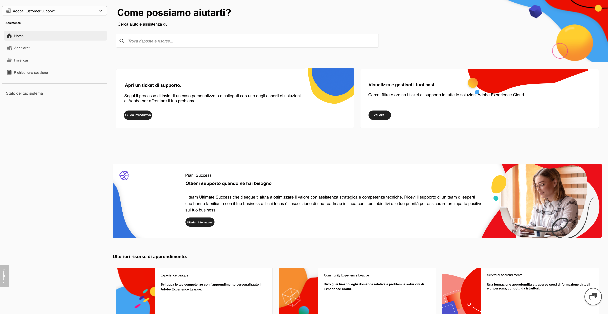
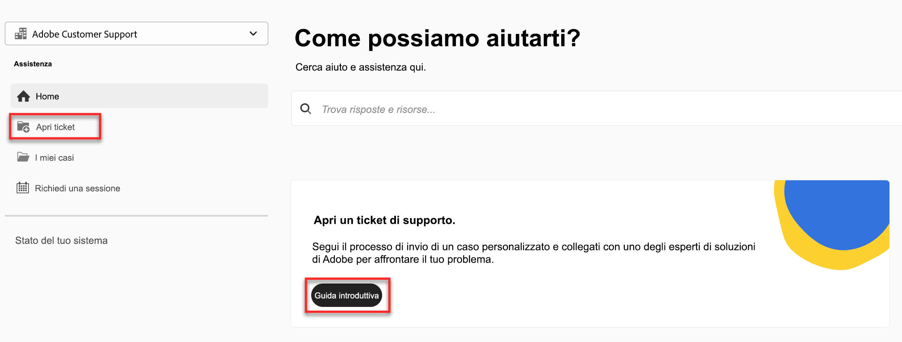
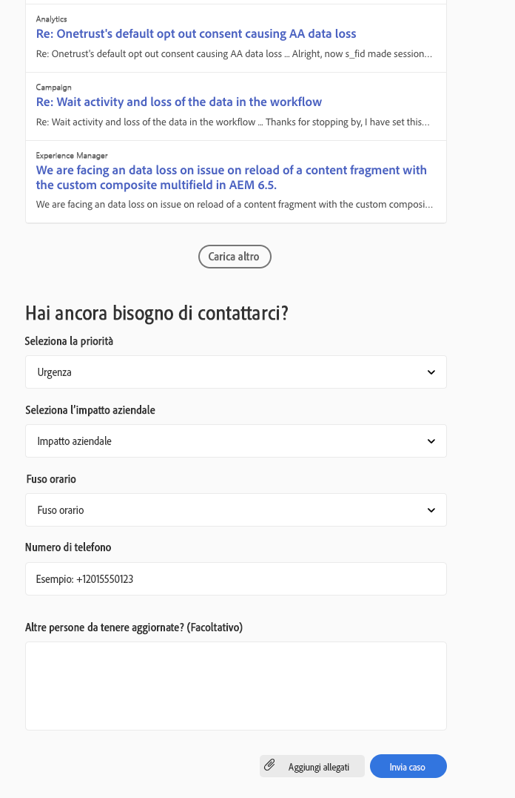

# Esperienza di accesso all’Assistenza clienti Adobe

## Ticket di assistenza in Experience League

I ticket di assistenza sono ora inviati tramite [Experience League](https://experienceleague.adobe.com/home?lang=it#support). Per sapere come inviare una richiesta di assistenza, consulta la sezione [Come inviare un ticket di supporto da Admin Console](#create-a-support-ticket-with-experience-league).

Stiamo lavorando per migliorare le modalità di interazione con l’Assistenza clienti Adobe. Per semplificare l’esperienza di accesso all’assistenza clienti, abbiamo deciso di implementare un unico punto di accesso in Experience League. Quando questo portale sarà online, la tua organizzazione potrà accedere facilmente all’Assistenza clienti Adobe, avere un quadro completo di tutte le richieste di supporto per i vari prodotti e richiedere aiuto tramite telefono, web e chat.

Se sei un utente di Adobe Commerce, consulta [Inviare un caso di supporto](https://experienceleague.adobe.com/it/docs/commerce-knowledge-base/kb/help-center-guide/magento-help-center-user-guide#support-case) nella Guida utente al supporto Experience League per Adobe Commerce.

## Ruoli autorizzati all’invio di casi di supporto {#submit-ticket}

Affinché tu possa inviare un ticket di supporto in [Experience League](https://experienceleague.adobe.com/home?lang=it#support), ti deve essere stato assegnato il ruolo Amministratore supporto dal tuo amministratore di sistema. Solo un amministratore di sistema della tua organizzazione può assegnarti questo ruolo. Gli amministratori di prodotti, profili di prodotto e altri non possono assegnare il ruolo di Amministratore supporto e non hanno accesso all’opzione **[!UICONTROL Crea caso]** che consente di inviare un ticket di supporto. Per ulteriori informazioni sui diversi tipi di ruoli amministratore e sui relativi diritti, consulta l’articolo [Ruoli di amministratore](admin-roles.md).

Se utilizzi Commerce, la procedura per condividere l’accesso e lavorare sui casi di supporto è diversa. Per ulteriori informazioni, consulta [Accesso condiviso: concedi privilegi ad altri utenti per accedere al tuo account](https://experienceleague.adobe.com/it/docs/commerce-knowledge-base/kb/help-center-guide/magento-help-center-user-guide#shared-access) nella Guida utente del supporto Experience League per Adobe Commerce.

### Aggiungere ruoli di supporto a un’organizzazione

Il ruolo di Amministratore supporto è un ruolo di tipo non amministrativo con accesso alle informazioni relative al supporto. Gli amministratori del supporto possono visualizzare, creare e gestire i rapporti sui problemi.

Per aggiungere o invitare un amministratore:

1. In Admin Console, scegli **[!UICONTROL Utenti]** > **[!UICONTROL Amministratori]**.
1. Fai clic su **[!UICONTROL Aggiungi amministratore]**.
1. Immetti un nome o un indirizzo e-mail.

   È possibile cercare gli utenti esistenti o aggiungere un nuovo utente specificando un indirizzo e-mail valido e compilando le informazioni richieste nella schermata.

   

1. Fai clic su **[!UICONTROL Avanti]**. Viene visualizzato un elenco di ruoli di amministratore.

Per assegnare a un utente il ruolo di Amministratore supporto (per consentire all’utente di contattare il team di assistenza):

1. Seleziona l’opzione **[!UICONTROL Amministratore supporto]**.

   

1. Scegli una delle due opzioni seguenti:

   * Opzione 1: **[!UICONTROL Amministratore del supporto base]**. Seleziona questa opzione per consentire all’utente di accedere all’assistenza per tutte le soluzioni (ad eccezione di Marketo Engage).
   * Opzione 2: **[!UICONTROL Amministratore del supporto prodotti]**: seleziona questa opzione per il supporto Marketo Engage. Seleziona le istanze di Marketo Engage per le quali vuoi consentire all’utente di accedere all’assistenza.

   

1. Dopo aver selezionato l’opzione desiderata, fai clic su **[!UICONTROL Salva]**.

L’utente riceve un invito e-mail da `message@adobe.com` relativo alle sue nuove autorizzazioni di amministratore.

L’utente deve fare clic su **Inizia** nell’e-mail per partecipare all’organizzazione. Se non si utilizza il link **Inizia** presente nell’invito e-mail, non sarà possibile accedere ad Admin Console.

Durante il processo di accesso, potrebbe venire richiesto di impostare un profilo Adobe, se non se ne possiede già uno. Se l’utente dispone di più profili associati al proprio indirizzo e-mail, dovrà scegliere **Iscriviti al team** (se richiesto) e quindi selezionare il profilo associato alla nuova organizzazione.

Per maggiori dettagli, segui le istruzioni su come [modificare il ruolo di amministratore Enterprise](admin-roles.md#add-enterprise-role), nella documentazione sui ruoli amministrativi. Tieni presente che solo un amministratore di sistema della tua organizzazione può assegnarti questo ruolo. Per ulteriori informazioni sulla gerarchia di amministrazione, consulta la documentazione sui [ruoli di amministratore](admin-roles.md).

### Creare un ticket di supporto in Experience League

>[!NOTE]
>
> Prima di inviare un ticket di supporto, è consigliabile verificare le prestazioni, la disponibilità e i problemi relativi alla soluzione del sistema Adobe nel sito [Adobe status](https://status.adobe.com).

La procedura per l’invio dei casi di supporto è ora integrata direttamente con la piattaforma di assistenza Experience League. Si tratta di un portale self-service recentemente rinnovato per offrire maggiore personalizzazione e facilità d’uso ai clienti autorizzati.

1. Per creare un ticket in [Experience League](https://experienceleague.adobe.com/home?lang=it#support), seleziona la scheda **[!UICONTROL Assistenza]** nell’area di navigazione superiore.
   
1. Dalla pagina home dell’assistenza, puoi passare facilmente ai casi di supporto aperti, registrare un nuovo caso, visualizzare gli articoli di assistenza principali o accedere a ulteriori fonti di apprendimento.
   
1. Per inviare un caso, seleziona **[!UICONTROL Apri un ticket di supporto]**. Selezionare anche l&#39;opzione **[!UICONTROL Apri ticket]** nel menu della barra laterale.

### Compila il ticket di supporto

1. Dopo aver selezionato **[!UICONTROL Apri un ticket di supporto]**, verrai indirizzato alla pagina di creazione del caso, in cui potrai immettere il nome del tuo prodotto (Audience Manager, Campaign, Target, ecc.), **[!UICONTROL Titolo caso]** e **[!UICONTROL Descrizione caso]**.

   

   Per accelerare il processo di risoluzione dei problemi, aggiungi le seguenti informazioni nel campo **[!UICONTROL Descrizione del caso]**:

   * Cancella l&#39;informativa sul problema
   * Passaggi da riprodurre
   * Dichiarazione sull&#39;impatto aziendale
   * Si tratta di una nuova implementazione / funzionalità / sviluppo?
   * Quando ha funzionato il processo?
   * Risoluzione dei problemi relativi alle azioni intraprese
   * Dati di registro rilevanti
   * Numero di versione
   * Informazioni sulla build (se pertinente)
   * Identificatori critici

1. Quando selezioni una soluzione, ti viene chiesto quanto segue e alcune soluzioni presentano dei campi aggiuntivi:

   * Priorità del caso (Bassa, Media, Alta, Critica)
   * Impatto aziendale
   * Fuso orario del cliente (America, EMEA, APAC)

   Per informazioni dettagliate su come la priorità dei casi e l&#39;impatto aziendale influiscono sui tempi di risposta del supporto, fare riferimento a [Tempi di risposta mirati iniziali per il supporto](https://experienceleague.adobe.com/it/docs/support-resources/data-sheets/overview#targeted-initial-response-times-for-support) nella documentazione relativa alle risorse dei piani di successo.

>[!TIP]
>
> Se non trovi l’opzione **[!UICONTROL Crea caso]** o la scheda **[!UICONTROL Assistenza]**, rivolgiti al tuo amministratore di sistema e chiedi che ti assegni il ruolo di Amministratore supporto.

>[!NOTE]
>
> Se il problema provoca interruzioni gravi in un sistema di produzione, viene fornito un numero di telefono da chiamare per ricevere assistenza immediata.

<!--

## What About the Legacy Systems?

New Tickets/Cases will no longer be able to be submitted in legacy systems as of May 11th.  The [Admin Console](https://adminconsole.adobe.com/) will be used to submit new tickets/cases.

### Existing Tickets/Cases

* Between May 11th and May 20th the legacy systems will remain available to work existing tickets/cases to completion.
* Beginning May 20th the support team will migrate remaining open cases from the legacy systems to the new support experience.  You will receive an email notification regarding how to contact support to continue to work these cases.
-->
