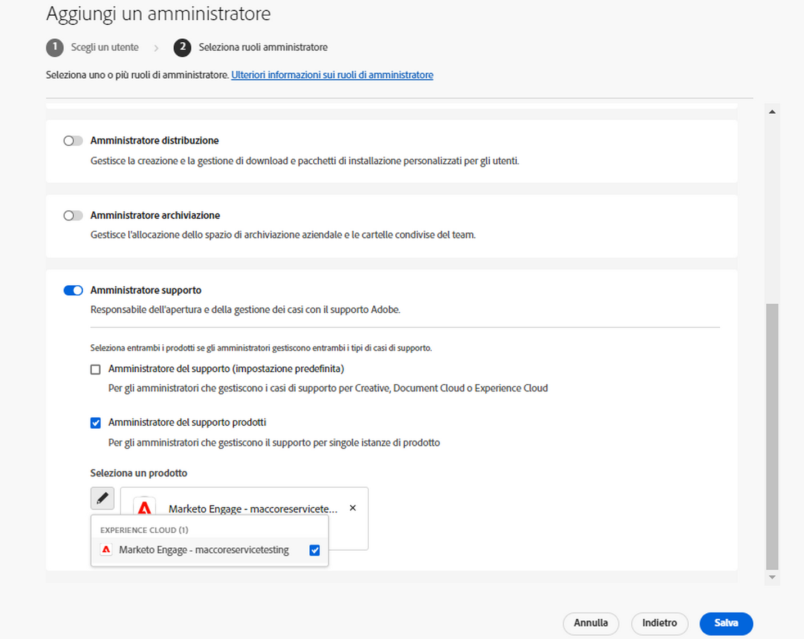

# Esperienza di accesso all’Assistenza clienti Adobe

## Ticket di supporto Experience League

I ticket di supporto sono ora inviati tramite [Experience League](https://experienceleague.adobe.com/home#support). Per sapere come inviare una richiesta di assistenza, consulta la sezione [Come inviare un ticket di supporto da Admin Console](#submit-ticket).

Stiamo lavorando per migliorare le modalità di interazione con l’Assistenza clienti Adobe. Il nostro obiettivo è semplificare l’esperienza di supporto passando a un singolo punto di ingresso, utilizzando Experience League. Quando questo portale comune sarà online, le organizzazioni potranno accedere facilmente all’Assistenza clienti Adobe, avere un quadro completo di tutte le richieste effettuate per i vari prodotti e richiedere assistenza tramite telefono, web e chat.

Se sei un utente di Adobe Commerce, consulta [Invia un caso di supporto](https://experienceleague.adobe.com/en/docs/commerce-knowledge-base/kb/help-center-guide/magento-help-center-user-guide#support-case) nella Guida utente del supporto Experience League per Adobe Commerce.

## Ruoli autorizzati di supporto necessari per l’invio dei casi {#submit-ticket}

Per inviare un ticket di supporto in [Experience League](https://experienceleague.adobe.com/home#support), è necessario che il ruolo di amministratore del supporto sia assegnato da un amministratore di sistema. Solo un amministratore di sistema della tua organizzazione può assegnarti questo ruolo. Gli amministratori di prodotti, profili di prodotto e altri non possono assegnare il ruolo di Amministratore supporto e non hanno accesso all’opzione **[!UICONTROL Crea caso]** che consente di inviare un ticket di supporto. Per ulteriori informazioni sui diversi tipi di ruoli di amministratore e sui relativi diritti, fare riferimento a [Ruoli di amministratore](admin-roles.md).

Se utilizzi Commerce, la procedura per condividere l’accesso e lavorare con i casi di supporto è diversa. Per ulteriori informazioni, consulta [Accesso condiviso: concedere privilegi ad altri utenti per accedere al tuo account](https://experienceleague.adobe.com/en/docs/commerce-knowledge-base/kb/help-center-guide/magento-help-center-user-guide#shared-access) nella Guida utente del supporto Experience League per Adobe Commerce.

### Aggiunta di ruoli di supporto a un’organizzazione

Il ruolo di Amministratore supporto è un ruolo di tipo non amministrativo con accesso alle informazioni relative al supporto. Gli amministratori del supporto possono visualizzare, creare e gestire i rapporti sui problemi.

Per aggiungere o invitare un amministratore:

1. In Admin Console, scegli **[!UICONTROL Utenti]** > **[!UICONTROL Amministratori]**.
1. Fai clic su **[!UICONTROL Aggiungi amministratore]**.
1. Immetti un nome o un indirizzo e-mail.

   È possibile cercare gli utenti esistenti o aggiungere un nuovo utente specificando un indirizzo e-mail valido e compilando le informazioni richieste nella schermata.

   

1. Fai clic su **[!UICONTROL Avanti]**. Viene visualizzato un elenco di ruoli di amministratore.

Per assegnare a un utente il ruolo di Amministratore supporto (per consentire all’utente di contattare il team di assistenza):

1. Seleziona l’opzione **[!UICONTROL Amministratore supporto]**.

   

1. Scegli una delle due opzioni seguenti:

   * Opzione 1: **[!UICONTROL Amministratore del supporto base]**. Seleziona questa opzione per consentire all’utente di accedere all’assistenza per tutte le soluzioni (ad eccezione di Marketo Engage).
   * Opzione 2: **[!UICONTROL Amministratore del supporto prodotti]**: seleziona questa opzione per il supporto Marketo Engage. Seleziona le istanze di Marketo Engage per le quali vuoi consentire all’utente di accedere all’assistenza.

   

1. Dopo aver selezionato l’opzione desiderata, fai clic su **[!UICONTROL Salva]**.

L’utente riceve un invito e-mail da `message@adobe.com` relativo alle sue nuove autorizzazioni di amministratore.

L’utente deve fare clic su **Inizia** nell’e-mail per partecipare all’organizzazione. Se non si utilizza il link **Inizia** presente nell’invito e-mail, non sarà possibile accedere ad Admin Console.

Durante il processo di accesso, potrebbe venire richiesto di impostare un profilo Adobe, se non se ne possiede già uno. Se l’utente dispone di più profili associati al proprio indirizzo e-mail, dovrà scegliere **Iscriviti al team** (se richiesto) e quindi selezionare il profilo associato alla nuova organizzazione.

Per maggiori dettagli, segui le istruzioni su come [modificare il ruolo di amministratore Enterprise](admin-roles.md#add-enterprise-role), nella documentazione sui ruoli amministrativi. Tieni presente che solo un amministratore di sistema della tua organizzazione può assegnarti questo ruolo. Per ulteriori informazioni sulla gerarchia di amministrazione, consulta la documentazione sui [ruoli di amministratore](admin-roles.md).

### Creare un ticket di supporto con Experience League

La procedura per l’invio dei casi di supporto è ora integrata direttamente con la piattaforma di supporto Experience League. Si tratta di un portale self-service recentemente riprogettato per offrire maggiore personalizzazione e facilità d’uso ai clienti autorizzati.

1. Per creare un ticket utilizzando [Experience League](https://experienceleague.adobe.com/home#support), seleziona la scheda **[!UICONTROL Supporto]** nella navigazione superiore.
   
1. Dalla home page del supporto, puoi passare facilmente ai casi di supporto aperti, registrare un nuovo caso, visualizzare gli articoli principali del Supporto o accedere a ulteriori fonti di apprendimento.
   
1. Per inviare un caso, selezionare **[!UICONTROL Apri un ticket di supporto]**. Selezionare anche l&#39;opzione **[!UICONTROL Apri ticket]** nel menu della barra laterale. Verrai indirizzato alla pagina di creazione del caso, dove puoi inserire il nome del prodotto (Audience Manager, Campagna, Target, ecc.), il titolo del caso e la descrizione del caso. Per accelerare il processo di risoluzione dei problemi, descrivi nel modo più descrittivo possibile il problema riscontrato.
   
1. Verso la fine del modulo, compilare i campi seguenti. Quando selezioni una soluzione, ti viene chiesto quanto segue e alcune soluzioni presentano campi aggiuntivi:

   * Priorità caso (bassa, Medium, alta, critica)
   * Impatto aziendale
   * Fuso orario cliente (America, EMEA, APAC)

>[!TIP]
>
> Se non trovi l’opzione **[!UICONTROL Crea caso]** o la scheda **[!UICONTROL Assistenza]**, rivolgiti all’amministratore di sistema e chiedi che ti assegni il ruolo di Amministratore supporto.

>[!NOTE]
>
> Se il problema provoca interruzioni o interruzioni gravi del sistema di produzione, viene fornito un numero di telefono per l&#39;assistenza immediata.

<!--

## What About the Legacy Systems?

New Tickets/Cases will no longer be able to be submitted in legacy systems as of May 11th.  The [Admin Console](https://adminconsole.adobe.com/) will be used to submit new tickets/cases.

### Existing Tickets/Cases

* Between May 11th and May 20th the legacy systems will remain available to work existing tickets/cases to completion.
* Beginning May 20th the support team will migrate remaining open cases from the legacy systems to the new support experience.  You will receive an email notification regarding how to contact support to continue to work these cases.
-->
