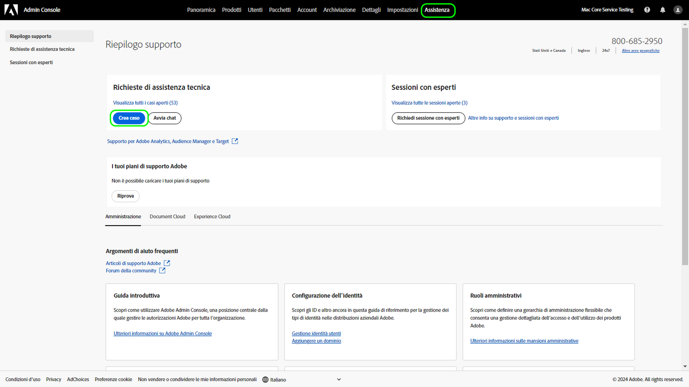
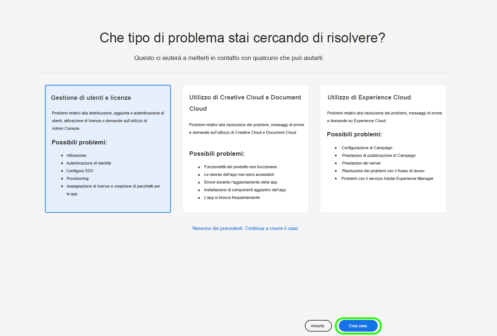

# Esperienza di accesso all’Assistenza clienti Adobe

## Ticket di assistenza da Admin Console

Ora è possibile inviare i ticket di assistenza tramite [Admin Console](https://adminconsole.adobe.com/). Per sapere come inviare una richiesta di assistenza, consulta la sezione [Come inviare un ticket di supporto da Admin Console](#submit-ticket).

Stiamo lavorando per migliorare le modalità di interazione con l’Assistenza clienti Adobe. Per semplificare l’esperienza di accesso all’assistenza clienti, abbiamo deciso di implementare un unico punto di accesso: Adobe Admin Console. Quando questo portale comune sarà online, le organizzazioni potranno accedere facilmente all’Assistenza clienti Adobe, avere un quadro completo di tutte le richieste effettuate per i vari prodotti e richiedere assistenza tramite telefono, web e chat.

## Come inviare un ticket di supporto da Admin Console {#submit-ticket}

Per consentirti di inviare un ticket di supporto da [Admin Console](https://adminconsole.adobe.com/), un amministratore di sistema deve averti assegnato il ruolo di Amministratore supporto. Solo un amministratore di sistema della tua organizzazione può assegnarti questo ruolo. Gli amministratori di prodotti, profili di prodotto e altri non possono assegnare il ruolo di Amministratore supporto e non hanno accesso all’opzione **[!UICONTROL Crea caso]** che consente di inviare un ticket di supporto. Per ulteriori informazioni, consulta la documentazione dedicata all’[assistenza per clienti Enterprise e Teams](customer-care.md).

### Assegnare il ruolo di Amministratore supporto

Il ruolo di Amministratore supporto è un ruolo di tipo non amministrativo con accesso alle informazioni relative al supporto. Gli amministratori del supporto possono visualizzare, creare e gestire i rapporti sui problemi.

Per aggiungere o invitare un amministratore:

1. In Admin Console, scegli **[!UICONTROL Utenti]** > **[!UICONTROL Amministratori]**.
1. Fai clic su **[!UICONTROL Aggiungi amministratore]**.
1. Immetti un nome o un indirizzo e-mail.

   È possibile cercare gli utenti esistenti o aggiungere un nuovo utente specificando un indirizzo e-mail valido e compilando le informazioni richieste nella schermata.

   

1. Fai clic su **[!UICONTROL Avanti]**. Viene visualizzato un elenco di ruoli di amministratore.

Per assegnare a un utente il ruolo di Amministratore supporto (per consentire all’utente di contattare il team di assistenza):

1. Seleziona l’opzione **[!UICONTROL Amministratore supporto]**.

   

1. Scegli una delle due opzioni seguenti:

   * Opzione 1: **[!UICONTROL Amministratore del supporto base]**. Seleziona questa opzione per consentire all’utente di accedere all’assistenza per tutte le soluzioni (ad eccezione di Marketo Engage).
   * Opzione 2: **[!UICONTROL Amministratore del supporto prodotti]**: seleziona questa opzione per il supporto Marketo Engage. Seleziona le istanze di Marketo Engage per le quali vuoi consentire all’utente di accedere all’assistenza.

   

1. Dopo aver selezionato l’opzione desiderata, fai clic su **[!UICONTROL Salva]**.

L’utente riceve un invito e-mail da `message@adobe.com` relativo alle sue nuove autorizzazioni di amministratore.

L’utente deve fare clic su **Inizia** nell’e-mail per partecipare all’organizzazione. Se non si utilizza il link **Inizia** presente nell’invito e-mail, non sarà possibile accedere ad Admin Console.

Durante il processo di accesso, potrebbe venire richiesto di impostare un profilo Adobe, se non se ne possiede già uno. Se l’utente dispone di più profili associati al proprio indirizzo e-mail, dovrà scegliere **Iscriviti al team** (se richiesto) e quindi selezionare il profilo associato alla nuova organizzazione.

Per maggiori dettagli, segui le istruzioni su come [modificare il ruolo di amministratore Enterprise](admin-roles.md#add-enterprise-role), nella documentazione sui ruoli amministrativi. Tieni presente che solo un amministratore di sistema della tua organizzazione può assegnarti questo ruolo. Per ulteriori informazioni sulla gerarchia di amministrazione, consulta la documentazione sui [ruoli di amministratore](admin-roles.md).

### Creare un ticket di supporto in Admin Console

Per creare un ticket in [Admin Console](https://adminconsole.adobe.com/), seleziona la scheda **[!UICONTROL Assistenza]** nell’area di navigazione superiore. Viene visualizzata la pagina [!UICONTROL Riepilogo supporto]. Quindi, seleziona l’opzione **[!UICONTROL Crea caso]**.

>[!TIP]
>
> Se non trovi l’opzione **[!UICONTROL Crea caso]** o la scheda **[!UICONTROL Assistenza]**, rivolgiti all’amministratore di sistema e chiedi che ti assegni il ruolo di Amministratore supporto.

Viene visualizzata una finestra di dialogo in cui puoi specificare il tipo di problema. Seleziona il tipo di problema che meglio descrive il problema o la domanda in questione, quindi seleziona **[!UICONTROL Crea caso]** in basso a destra.

Viene visualizzata la finestra di dialogo **[!UICONTROL Crea caso]**. Ti viene chiesto di fornire alcune informazioni come il prodotto, il livello di priorità e una descrizione, e di allegare eventuali schermate che possano illustrare il problema. Seleziona **[!UICONTROL Successivo]** per continuare.

>[!NOTE]
>
> Se il problema provoca interruzioni estremamente gravi in un sistema di produzione, viene fornito un numero di telefono da chiamare per ricevere assistenza immediata.

Nella pagina successiva puoi inserire i dati di contatto e specificare il momento migliore in cui l’Assistenza clienti potrà contattarti. Al termine, seleziona **[!UICONTROL Invia]** in basso a destra; il ticket viene inviato all’Assistenza clienti Adobe.

<!--

## What About the Legacy Systems?

New Tickets/Cases will no longer be able to be submitted in legacy systems as of May 11th.  The [Admin Console](https://adminconsole.adobe.com/) will be used to submit new tickets/cases.

### Existing Tickets/Cases

* Between May 11th and May 20th the legacy systems will remain available to work existing tickets/cases to completion.
* Beginning May 20th the support team will migrate remaining open cases from the legacy systems to the new support experience.  You will receive an email notification regarding how to contact support to continue to work these cases.
-->
