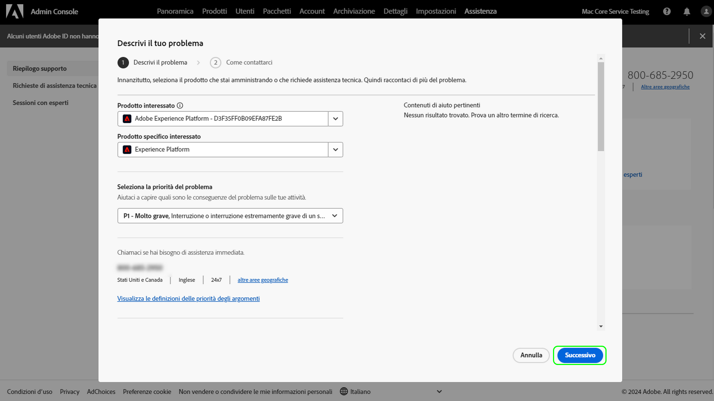

# Adobe Customer Support Experience

## Ticket di supporto per Admin Console

È ora possibile inviare i ticket di assistenza tramite il [Admin Console](https://adminconsole.adobe.com/). Per istruzioni su come inviare un ticket di assistenza, consulta la sezione per [invio di un ticket di supporto](#submit-ticket).

Stiamo lavorando per migliorare il modo in cui interagisci con l’Assistenza clienti Adobe. Il nostro obiettivo è quello di semplificare l&#39;esperienza di assistenza passando a un singolo punto di ingresso, utilizzando Adobe Admin Console. Una volta pubblicata, la tua organizzazione sarà in grado di accedere facilmente all’Assistenza clienti Adobe; avere una maggiore visibilità nella cronologia dei servizi attraverso un sistema comune tra i prodotti; e richiedere aiuto tramite telefono, web e chat attraverso un unico portale.

## Come inviare un ticket di supporto di Admin Console {#submit-ticket}

Per presentare un ticket di supporto in [Admin Console](https://adminconsole.adobe.com/), è necessario che il ruolo di amministratore del supporto sia assegnato da un amministratore di sistema. Solo un amministratore di sistema della tua organizzazione può assegnare questo ruolo. I ruoli di prodotto, profilo di prodotto e altri ruoli amministrativi non possono assegnare il ruolo di amministratore del supporto e non sono in grado di visualizzare il **[!UICONTROL Crea caso]** per inviare un ticket di supporto. Per ulteriori informazioni, visita il [Assistenza clienti aziendale e team](customer-care.md) documentazione.

### Assegnare il ruolo di amministratore del supporto

Il ruolo di amministratore del supporto è un ruolo non amministrativo con accesso alle informazioni relative al supporto. Gli amministratori del supporto possono visualizzare, creare e gestire i rapporti sui problemi.

Per assegnare il ruolo di amministratore del supporto, segui la [modifica ruolo amministratore organizzazione](admin-roles.md#add-enterprise-role) nella documentazione sui ruoli amministrativi. Solo un amministratore di sistema della tua organizzazione può assegnare questo ruolo. Per ulteriori informazioni sulla gerarchia amministrativa, visita il [ruoli amministrativi](admin-roles.md) documentazione.

### Crea un ticket di supporto con Admin Console

Per creare un ticket utilizzando [Admin Console](https://adminconsole.adobe.com/), seleziona **[!UICONTROL Supporto]** nella navigazione superiore. La [!UICONTROL Riepilogo del supporto] viene visualizzata la pagina . Quindi, seleziona la **[!UICONTROL Crea caso]** opzione .

>[!TIP]
>
> Se non riesci a visualizzare il **[!UICONTROL Crea caso]** oppure **[!UICONTROL Supporto]** per assegnare il ruolo di amministratore del supporto, è necessario contattare un amministratore di sistema.

Viene visualizzata una finestra di dialogo che consente di selezionare un tipo di problema. Seleziona il tipo di problema che meglio descrive il problema o la domanda, quindi seleziona **[!UICONTROL Crea caso]** in basso a destra.

La **[!UICONTROL Crea caso]** viene visualizzata la finestra di dialogo . Ti viene chiesto di fornire alcune informazioni come il prodotto, la priorità, la descrizione e di allegare eventuali schermate per aiutarti a descrivere il problema. Seleziona **[!UICONTROL Successivo]** per continuare.

>[!NOTE]
>
> Se il problema si traduce in interruzioni o interruzioni estremamente gravi di un sistema di produzione, viene fornito un numero di telefono per l&#39;assistenza immediata.

La pagina successiva ti consente di inserire le informazioni di contatto e di fornire il momento migliore per contattare ad Adobe l’Assistenza clienti. Al termine, seleziona **[!UICONTROL Invia]** in basso a destra e il ticket viene inviato all’Assistenza clienti Adobe.

<!--

## What About the Legacy Systems?

New Tickets/Cases will no longer be able to be submitted in legacy systems as of May 11th.  The [Admin Console](https://adminconsole.adobe.com/) will be used to submit new tickets/cases.

### Existing Tickets/Cases

* Between May 11th and May 20th the legacy systems will remain available to work existing tickets/cases to completion.
* Beginning May 20th the support team will migrate remaining open cases from the legacy systems to the new support experience.  You will receive an email notification regarding how to contact support to continue to work these cases.
-->
