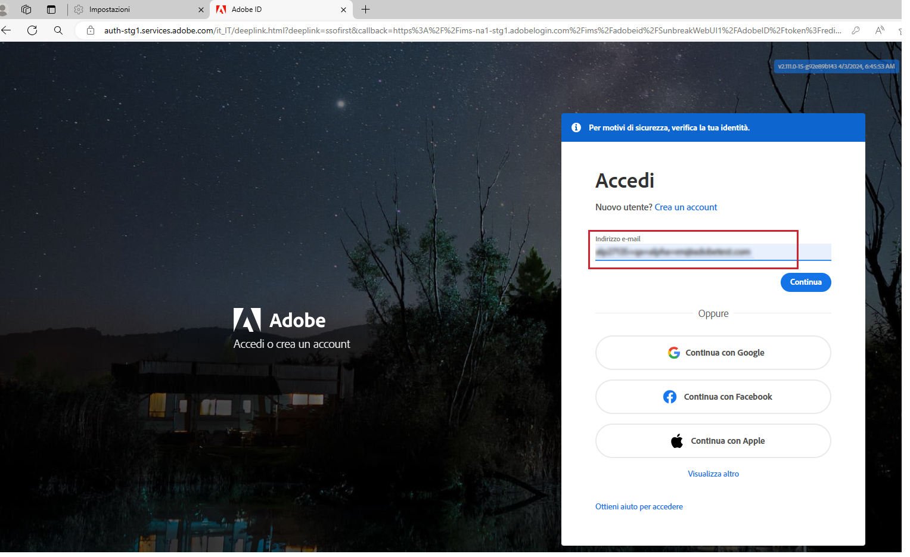
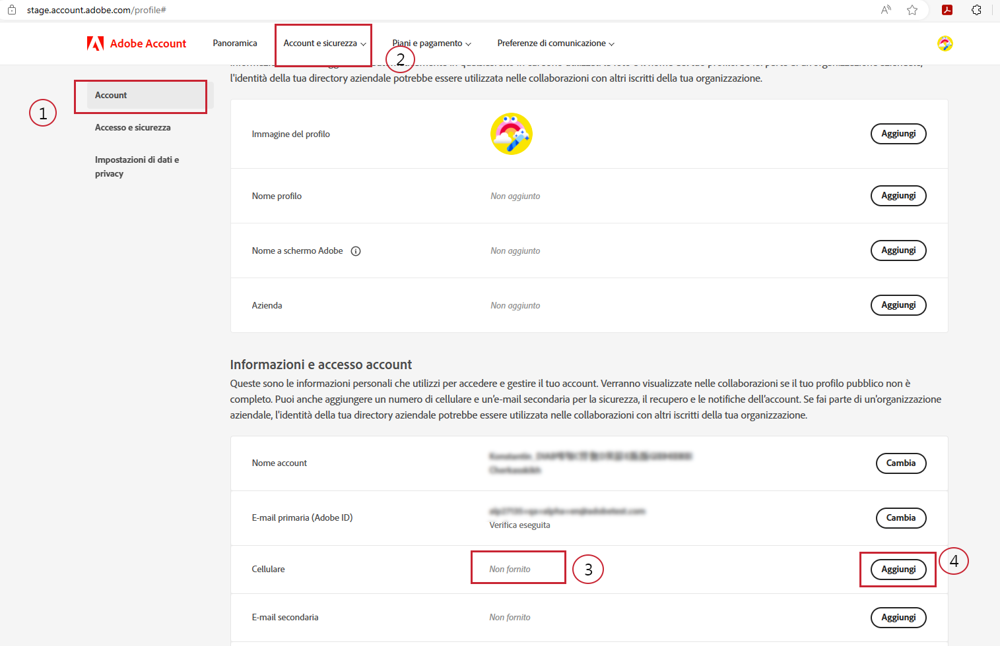
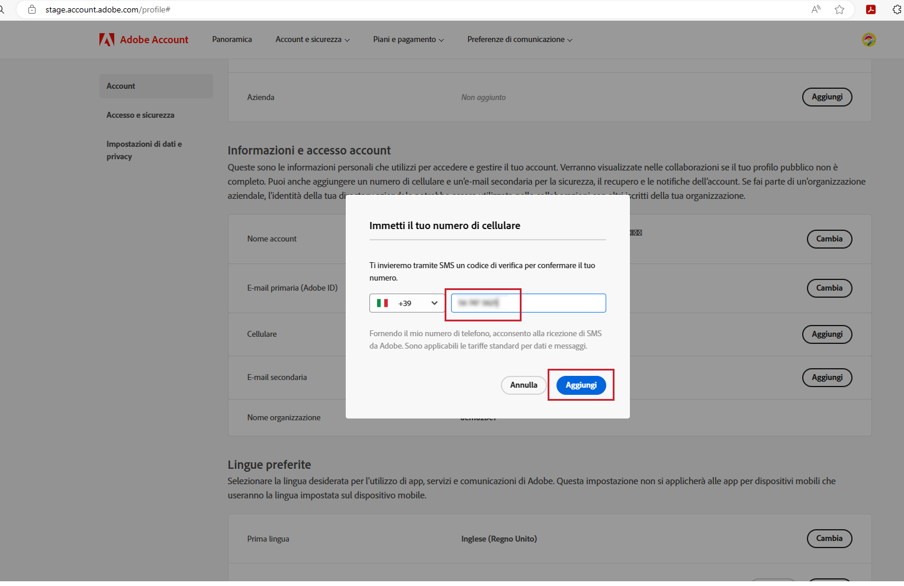
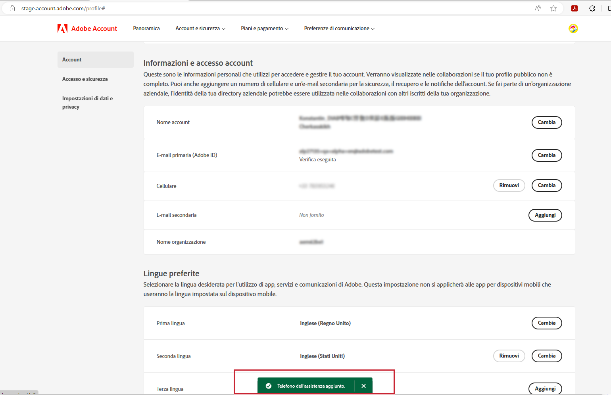

# Specificare il numero di telefono preferito per l’assistenza

Quando ti viene assegnato un ruolo di Amministratore, ad esempio “Amministratore del supporto prodotti”, ti viene inviata un’e-mail per informarti che disponi dei diritti di Amministratore per gestire l’istanza per la quale ti sono stati concessi tali diritti.

L&#39;e-mail ora contiene il testo riportato di seguito in rosso, che spiega come passare al profilo del tuo account e comunicarci il numero di telefono preferito da utilizzare per il servizio di assistenza.

Per specificare il numero di telefono preferito:

1. Fai clic sul collegamento **Profilo account** per aprire una nuova finestra per accedere utilizzando `account.adobe.com`.

   

1. Segui la procedura di accesso fino ad arrivare alla schermata riportata di seguito in `account.adobe.com`.
1. Quindi fai clic sulle schede Account e sicurezza > Account (riportate di seguito) per trovare il campo per il numero di telefono di assistenza.
1. Aggiungi il numero di telefono che ci permetterà di riconoscerti per le tue esigenze di assistenza.

